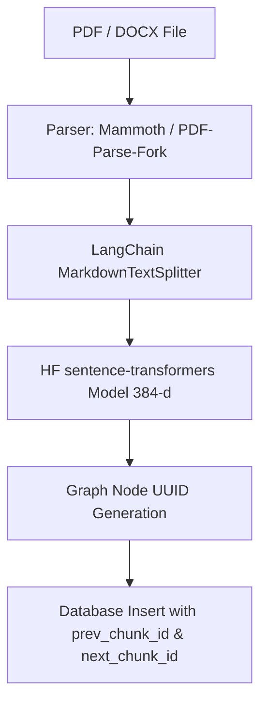
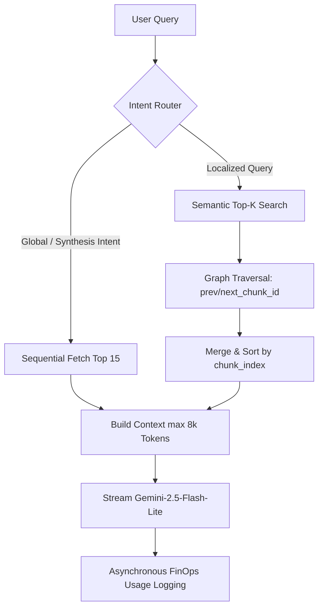

# 🧠 DocMind AI — Next-Generation Intelligent Document Assistant

> Give a voice to your documents using an advanced hybrid RAG architecture, a linear GraphRAG traversal engine, and ultra-secure multi-tenant workspace isolation.

---

## 🌟 Overview

**DocMind** is a state-of-the-art Retrieval-Augmented Generation (RAG) web application that enables users to upload complex documents (PDFs, technical specs, DOCX contracts) and chat with them instantly.

By combining an intelligent **Multi-Routing** pipeline with a **linear GraphRAG architecture**, DocMind transcends standard vector-only matching. It preserves narrative continuity and structural sequence, eliminating hallucinations and delivering exact, verifiable citations in milliseconds.

---

## 🛠️ Key Architectural Features

### 1. 🧬 Linear GraphRAG & Hybrid Ingestion
* **Intelligent Structural Chunking:** Uses `MarkdownTextSplitter` with an optimized character window (`chunkSize: 800`) and a 25% overlap (`chunkOverlap: 200`) to preserve code blocks, tables, and critical list alignments.
* **Resilient Embedding Generation:** Employs `sentence-transformers/all-MiniLM-L6-v2` via Hugging Face to output high-fidelity 384-dimensional vector embeddings. The pipeline features a network resilience wrapper with a **30-second timeout and exponential backoff retry**.
* **Linear Graph Weaving:** During ingestion, chunks are chronologically chained to their immediate neighbors using database pointers (`prev_chunk_id` and `next_chunk_id`).

### 2. 🛣️ Multi-Router Retrieval & Graph Neighborhood Expansion
* **Global Intent Detection:** Queries looking for summaries or syntheses automatically route to a sequential RAG pathway that retrieves the document's top 15 sequential chunks.
* **Semantic Search + Graph Traversal:** For specific queries, DocMind queries the database (Top-K) and then **traverses the graph links** to gather adjacent contextual nodes, reconstructing the surrounding narrative.
* **Narrative Reordering:** All retrieved chunks are sorted by `chunk_index` before being sent in the system prompt, providing coherent reading order to the LLM.

### 3. 🧠 LLM Orchestration & SSE Streaming
* **Gemini 2.5 Flash Lite:** Interfaces with Google's high-efficiency model via `@google/generative-ai` for rapid responses.
* **Server-Sent Events (SSE) Streaming:** Delivers token streaming directly into an interactive web interface.
* **Sliding Memory Window:** Maintains conversational history with an optimized window size (`MEMORY_WINDOW_SIZE = 6`) to preserve context without exceeding token boundaries.

### 4. 📊 FinOps Usage Logging & Traffic Shaping
* **Granular Cost Ingestion:** Asynchronously logs every request's token usage (input and output) in `ai_usage_logs`, calculating the exact cost in USD down to the microcent.
* **Token Bucket Rate Limiting:** Safeguards endpoints against API abuse using a high-performance in-memory token bucket algorithm.
* **Strict RLS Isolation:** Enforces absolute privacy per workspace via PostgreSQL Row-Level Security (RLS) in Supabase.

---

## 📐 Pipeline Architecture Diagrams

### Document Ingestion Flow


### RAG Retrieval & Generation Flow


---

## 📁 Project Structure

```text
docmind/
├── app/                  # Next.js Application (App Router)
│   ├── (app)/            # Connected Dashboard Layout & Pages
│   │   └── dashboard/    # User Dashboard & Workspace [docId] pages
│   ├── (auth)/           # Authentication layout, login & register pages
│   ├── api/              # Serverless API Endpoints
│   │   ├── chat/         # RAG streaming & Gemini chat completions
│   │   ├── upload/       # Document ingestion, chunking, vectorization, & graph setup
│   │   └── documents/    # CRUD endpoints for managing uploaded documents
│   ├── globals.css       # Tailwind 4 Design System and Global Styles
│   └── layout.tsx        # Root layout
├── components/           # UI Components (shadcn/ui, Framer Motion)
│   ├── chat/             # Interactive chat interface with citations
│   ├── dashboard/        # Dashboard layout, list grids & analytics
│   ├── upload/           # Drag-and-drop file ingestion zone
│   └── viewer/           # Two-column document viewer pane
├── hooks/                # Custom React Hooks (theme, chat triggers, etc.)
├── lib/                  # Business Logic & Utility Modules
│   ├── documents/        # File parsing, chunking, & bucket storage helpers
│   ├── rag/              # AI Core (HF embeddings, retriever, RAG orchestrator)
│   ├── limiter.ts        # In-memory Token Bucket rate limiter
│   ├── supabase.ts       # Supabase client-side cookie-sharing configuration
│   └── supabase-server.ts# Supabase server-side admin-role connection client
└── package.json          # Dependency mappings & launch scripts
```

---

## 🗄️ Supabase Database Schema (SQL Setup)

Run the following SQL script inside your Supabase **SQL Editor** to initialize the database extensions, tables, vector search indices, and the Postgres search RPC function.

```sql
-- 1. Enable pgvector extension for embedding operations
CREATE EXTENSION IF NOT EXISTS vector;

-- 2. Create Documents Table
CREATE TABLE IF NOT EXISTS documents (
    id UUID PRIMARY KEY DEFAULT gen_random_uuid(),
    user_id UUID NOT NULL,
    name TEXT NOT NULL,
    file_url TEXT NOT NULL,
    file_type TEXT NOT NULL, -- 'pdf' or 'docx'
    chunk_count INT NOT NULL,
    created_at TIMESTAMP WITH TIME ZONE DEFAULT timezone('utc'::text, now()) NOT NULL
);

-- 3. Create Document Chunks Table with Graph Relations
CREATE TABLE IF NOT EXISTS document_chunks (
    id UUID PRIMARY KEY, -- Pre-generated client-side UUID for graphing
    document_id UUID REFERENCES documents(id) ON DELETE CASCADE NOT NULL,
    user_id UUID NOT NULL,
    content TEXT NOT NULL,
    chunk_index INT NOT NULL,
    token_count INT NOT NULL,
    embedding vector(384), -- 384-d embeddings generated from MiniLM-L6-v2
    prev_chunk_id UUID REFERENCES document_chunks(id) ON DELETE SET NULL,
    next_chunk_id UUID REFERENCES document_chunks(id) ON DELETE SET NULL,
    created_at TIMESTAMP WITH TIME ZONE DEFAULT timezone('utc'::text, now()) NOT NULL
);

-- 4. Create FinOps Billing Logs Table
CREATE TABLE IF NOT EXISTS ai_usage_logs (
    id UUID PRIMARY KEY DEFAULT gen_random_uuid(),
    user_id UUID NOT NULL,
    document_id UUID REFERENCES documents(id) ON DELETE CASCADE,
    tokens_input INT NOT NULL,
    tokens_output INT NOT NULL,
    cost_usd NUMERIC(10, 6) NOT NULL,
    created_at TIMESTAMP WITH TIME ZONE DEFAULT timezone('utc'::text, now()) NOT NULL
);

-- 5. Create High-Performance Vector HNSW Index
CREATE INDEX IF NOT EXISTS document_chunks_embedding_hnsw_idx 
ON document_chunks 
USING hnsw (embedding vector_cosine_ops);

-- 6. Create Semantic Retrieval RPC Function (match_chunks)
CREATE OR REPLACE FUNCTION match_chunks (
  query_embedding vector(384),
  match_document_id UUID,
  match_user_id UUID,
  match_count INT,
  similarity_threshold FLOAT
)
RETURNS TABLE (
  id UUID,
  content TEXT,
  chunk_index INT,
  similarity FLOAT,
  prev_chunk_id UUID,
  next_chunk_id UUID
)
AS $$
BEGIN
  RETURN QUERY
  SELECT
    dc.id,
    dc.content,
    dc.chunk_index,
    1 - (dc.embedding <=> query_embedding) AS similarity,
    dc.prev_chunk_id,
    dc.next_chunk_id
  FROM document_chunks dc
  WHERE dc.document_id = match_document_id
    AND dc.user_id = match_user_id
    AND 1 - (dc.embedding <=> query_embedding) > similarity_threshold
  ORDER BY dc.embedding <=> query_embedding
  LIMIT match_count;
END;
$$ LANGUAGE plpgsql;
```

---

## ⚙️ Environment Variables Config

Create a `.env.local` file at the root of the project and define the following keys:

```env
# Supabase Local & Server Configuration
NEXT_PUBLIC_SUPABASE_URL=https://your-project-id.supabase.co
NEXT_PUBLIC_SUPABASE_ANON_KEY=eyJhbGciOiJIUzI1NiIsInR5cCI6IkpXVCJ9...
SUPABASE_SERVICE_ROLE_KEY=eyJhbGciOiJIUzI1NiIsInR5cCI6IkpXVCJ9...

# Google Gemini API Credentials
GOOGLE_API_KEY=AIzaSy...

# Hugging Face Inference API Credentials (for Embeddings)
HUGGINGFACE_API_KEY=hf_...
```

---

## 🚀 Quick Start

### 1. Install Dependencies
```bash
npm install
```

### 2. Spin up the Development Server
```bash
npm run dev
```

Open [http://localhost:3000](http://localhost:3000) on your web browser to explore the DocMind interactive workspace.

---

## 📈 Available Scripts

* `npm run dev` : Runs the Next.js server in development mode.
* `npm run build` : Packages the web application for production use.
* `npm run start` : Launches the built production server.
* `npm run lint` : Runs ESLint checks to capture code styling or syntax anomalies.

---

## 🛡️ License

This codebase is licensed under the MIT License. For additional details or engineering assistance, feel free to open a ticket in the repository issues tracker.
